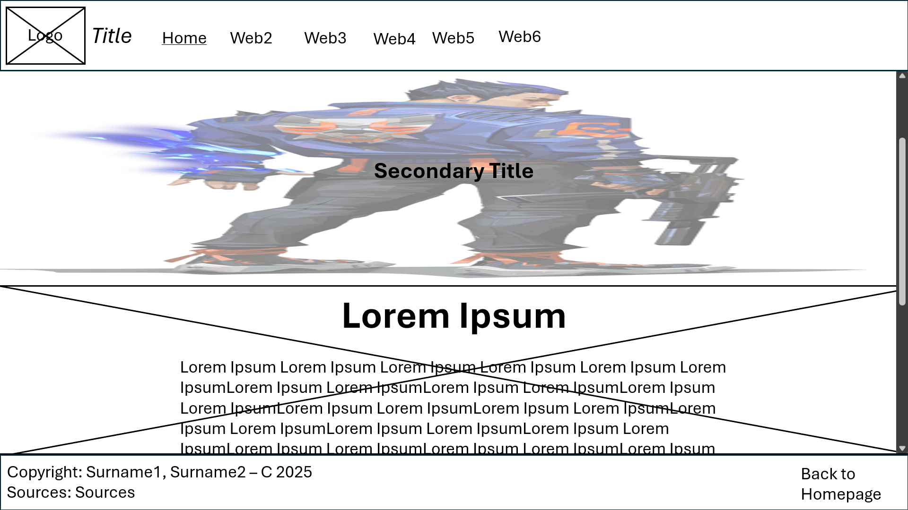

# Rb Crisostomo Lozano Project Proposal
### Title: Valofy.gg
#### VALORANT — A comprehensive guide to the 5v5 tactical shooter

### Website Logo:
### 
#### File:Radiant_Rank.png - Valorant Wiki Fandom. (N.D.). Retrieved October 28, 2025, from https://static.wikia.nocookie.net/valorant/images/1/1a/Radiant_Rank.png/revision/latest?cb=20200623203621

### Description:
##### This website will be introducing Valorant to people who want to get to know the game and its mechanics better and who want to play the game, or even for current players who want to know more about how to play competitively and effectively.

### Outline of webpages:
1. **Homepage**
-- This is the main landing page of anyone who visits the website.
2. **Agent Roles**
-- This page shows the 4 main roles of agents (Duelist, Controller, Initiator, Sentinel), and how to play using them.
3. **Agent List**
-- This shows all the 28 agents currently in the game, and which of the 4 roles they fall into. It also shows a brief description of their abilities and their lore.
4. **Maps**
-- This page shows all the 18 maps in the game, and also shows the 12 maps in the current Competitive/Standard map pool, with 6 maps being grayscaled.
5. **Competitive**
-- This webpage shows all the 9 Competitive ranks in Valorant, from the lowest (Iron) to the highest (Radiant).
6. **Mini-game**
-- This webpage is a mini-game for the website, a Trivia Valorant Quiz! *(NOTE: This is also the webpage we will use JS on)*
7. **Sources**
-- This page will show all the sources used in the project in APA citation.

### Wireframe:
#### 

### Index:
#### [Index](public/index.html)